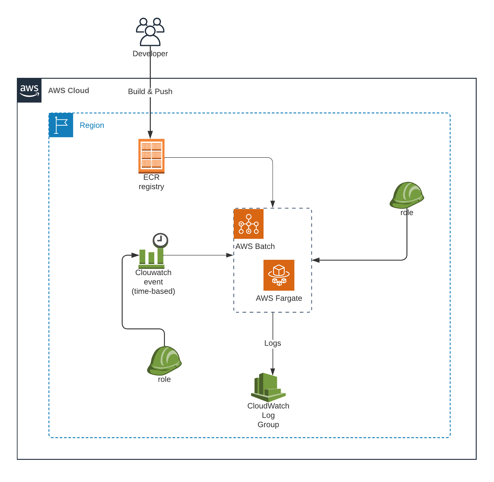

# AWS Batch Job using Fargate 
The following artifact was designed to assist customers interested in deploying AWS Batch jobs using Amazon ECS Fargate launch type.

We have developed a Terraform module that can be utilized to deploy a batch job by building the container image, pushing it to ECR and deploying AWS Batch job configurations. This module also sets the schedule for the job by utilizing AWS Event Bridge.

## Architecture


## Prerequisites

The following tools/utilities must be installed and configured on your machine (local/remote) that is being used for deploying.

- Terraform
- AWS credentials
- Docker

## Directory Structure
<pre>
├── README.md
├── examples
│   └── batch-fargate-docker
│       ├── main.tf
│       ├── output.tf
│       ├── src
│       │   ├── Dockerfile
│       │   ├── hello_mars.py
│       │   └── requirements.txt
│       ├── terraform.tfvars
│       └── variables.tf
└── modules
    └── batch-fargate-docker
        ├── main.tf
        ├── output.tf
        ├── providers.tf
        └── variable.tf
</pre>


## Deploying AWS Batch Infrastructure
***Note:*** We will use a sample code to depoly a batch job. You can review the code and Dockerfile in `examples/batch-fargate-docker/src/` directory. 

Please follow the instruction steps to deploy a sample job using the module.

### Steps

1. Change Directory
```
cd examples/batch-fargate-docker
```

2. Update terraform.tfvars 
Open text editor and update the varaibles as required.

3. Terraform initialize
```
terraform init
```

4. Generate Terraform plan

Verify resources that will get deployed.
```
terraform plan
```
5. Deploy reources

```
terraform apply --auto-approve 
```

6. To cleanup reources

```
terraform destroy --auto-approve 
```